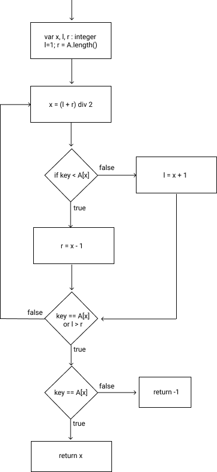

# black-box-testing
Repo for Lab 2 in DD2459 - Software Reliability
## 1

## 2 
The pre- and postconditions for each function are written in the source file Exercises.java.

## 3 
The programs are implemented in the source file Exercies.java.

## 4 
#### Is it better to treat an array input variable of length N as one variable or as N individual variables?
It is better to treat it as N individual variables in order to utilize pairwise testing as it would not be useful to use pairwise testing given only 2 variables.
